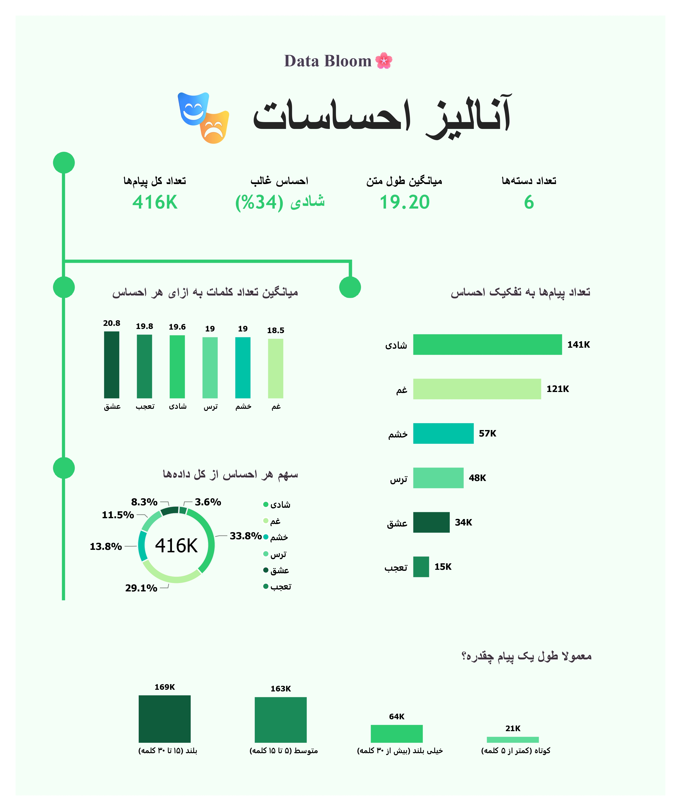

# 🧠 Persian Emotion Analysis Dashboard | Power BI

<p align="center">
  
</p>

## 📌 Overview

This project is an interactive **Power BI dashboard for analyzing emotions in Persian messages**.

The dashboard explores a dataset of **416K messages** across **6 different emotion categories**, focusing on emotional distribution, message length, and the characteristics of messages associated with each emotion.

The main goal of the project is to transform a large collection of text-based data into a simple and interactive visual story that makes emotional patterns easier to understand.

---

## 📊 Dashboard at a Glance

The dashboard provides a high-level overview of the dataset through several KPIs and visualizations.

### Key Metrics

| Metric | Value |
| --- | --- |
| Total messages | **416K** |
| Emotion categories | **6** |
| Average words per message | **19.20** |
| Dominant emotion share | **34%** |

### Emotion Categories

The dataset contains six emotion categories:

- Happiness
- Sadness
- Anger
- Fear
- Love
- Surprise

---

## 🎯 Dashboard Objectives

The dashboard was designed to answer questions such as:

- How many messages are included in the dataset?
- How are messages distributed across different emotions?
- Which emotion appears most frequently?
- What percentage of all messages belongs to the dominant emotion?
- How does message length vary across emotions?
- What is the average number of words for each emotion?
- What share of the dataset belongs to each emotion?
- How are messages distributed across different length categories?

---

## 📈 Dashboard Components

### 1. Total Messages

Displays the total number of messages available in the dataset.

**Value:** 416K

This KPI provides the overall scale of the dataset and acts as the main reference point for the other metrics.

---

### 2. Dominant Emotion

Identifies the emotion with the highest number of messages and calculates its share of the entire dataset.

**Current dashboard result:** Happiness (34%)

This metric combines both the most frequent emotion and its percentage of the total dataset into a single KPI.

---

### 3. Average Message Length

Shows the average number of words per message.

**Average:** 19.20 words

This KPI helps provide context about the typical size of a message in the dataset.

---

### 4. Number of Emotion Categories

Shows the number of unique emotion categories in the dataset.

**Value:** 6

This metric is calculated dynamically using the distinct emotion values.

---

### 5. Message Count by Emotion

A horizontal bar chart compares the number of messages across the six emotion categories.

This visual makes it easy to compare the frequency of:

- Happiness
- Sadness
- Anger
- Fear
- Love
- Surprise

---

### 6. Average Words per Emotion

This chart compares the average number of words used in messages belonging to each emotion.

The visualization helps explore whether some emotional categories tend to contain shorter or longer messages.

---

### 7. Emotion Share of Total Messages

A donut chart shows the percentage contribution of each emotion to the complete dataset.

The center of the chart displays the total number of messages, while the surrounding segments represent the relative share of each emotion.

---

### 8. Message Length Distribution

Messages are grouped into different length categories:

| Category | Range |
| --- | --- |
| **Short** | Less than 5 words |
| **Medium** | 5–15 words |
| **Long** | 15–30 words |
| **Very Long** | More than 30 words |

The chart shows how many messages fall into each category.

---

## 🔢 DAX Measures

DAX was used to create the main KPIs and dynamic calculations used throughout the dashboard.

### Total Messages

```dax
تعداد کل پیام‌ها = 
COUNTROWS(Emotions)
```

This measure counts the total number of rows in the `Emotions` table.

It is used as the main dataset-size KPI and also provides the denominator for percentage-based calculations.

---

### Number of Emotion Categories

```dax
تعداد دسته‌ها = 
DISTINCTCOUNT(Emotions[احساس])
```

This measure counts the number of unique emotion categories.

It allows the dashboard to dynamically display the number of available emotions rather than using a hard-coded value.

---

### Average Message Length

```dax
میانگین طول متن = 
ROUND(
    AVERAGE(Emotions[تعداد کلمات]),
    1
)
```

This measure calculates the average number of words per message.

`ROUND()` is used to keep the result concise and display it with one decimal place.

The measure is useful for understanding the typical length of messages in the dataset.

---

### Dominant Emotion

```dax
احساس غالب = 

VAR TopEmotion = 
    CALCULATE(
        VALUES(Emotions[احساس]),
        TOPN(
            1,
            ALL(Emotions[احساس]),
            CALCULATE(COUNTROWS(Emotions))
        )
    )

VAR MaxCount = 
    CALCULATE(
        COUNTROWS(Emotions), 
        ALL(Emotions[احساس]), 
        Emotions[احساس] = TopEmotion
    )

VAR TotalCount = 
    COUNTROWS(Emotions)

VAR SharePct = 
    DIVIDE(
        MaxCount,
        TotalCount
    )

RETURN 
    TopEmotion & 
    " (" & 
    FORMAT(SharePct, "0%") & 
    ")"
```

This is one of the main dynamic measures in the dashboard.

It performs three main tasks:

1. Finds the emotion with the highest number of messages.
2. Calculates the number of messages belonging to that emotion.
3. Calculates its percentage of the entire dataset.

The final result combines the emotion name and its share into a single value, for example:

```text
Happiness (34%)
```

This makes the KPI more informative than showing only the emotion name.

---

### Transparent Background Utility

```dax
حذف بک گراند = 
"rgba(255, 255, 255, 0)"
```

This utility measure returns a transparent RGBA value and can be used in the visual design to help integrate elements with the dashboard background.

---

## 🧩 Data Analysis Approach

The project follows a simple BI workflow:

### 1. Data Preparation

The source data contains text messages and their associated emotion categories.

The data is prepared for analysis in Power BI before building the dashboard.

### 2. KPI Development

DAX measures were created to calculate:

- Total messages
- Number of emotion categories
- Average message length
- Dominant emotion
- Dominant emotion share

### 3. Visual Analysis

Different visual types were selected based on the analytical purpose:

| Visual | Purpose |
| --- | --- |
| KPI Cards | High-level dataset summary |
| Horizontal Bar Chart | Compare message counts by emotion |
| Column Chart | Compare average message length |
| Donut Chart | Show emotion share |
| Bar Chart | Analyze message length distribution |

### 4. Data Storytelling

The dashboard is structured from general information to more detailed analysis:

```text
Dataset Overview → Emotion Distribution → Message Characteristics → Message Length
```

This structure allows users to quickly understand the dataset before exploring individual emotional patterns.

---

## 💡 Key Insights

Based on the dashboard:

- The dataset contains approximately **416K** messages.
- Messages are categorized into **6** emotions.
- The average message contains approximately **19.2** words.
- **Happiness** is the dominant emotion in the displayed dataset, accounting for approximately **34%** of all messages.
- Emotion categories have different average message lengths.
- Message lengths are distributed across short, medium, long, and very long categories.
- The emotion distribution is not uniform, with noticeable differences in message counts between categories.

These observations are descriptive and reflect the values displayed in the dashboard.

---

## 🎨 Dashboard Design

The dashboard uses a clean, minimal visual style with:

- Light background
- Green-based color palette
- Large Persian typography
- Clear KPI cards
- Consistent visual hierarchy
- Minimal visual clutter
- Rounded and simple visual elements
- A timeline-inspired decorative structure on the left side

The design was intentionally kept simple so that the emotional distribution and message statistics remain the main focus.

---

## 🛠️ Tools & Technologies

- Power BI Desktop
- DAX
- Power Query
- Data Visualization
- Data Analysis
- Dashboard Design
- Data Storytelling

---

## 📐 Dashboard Structure

The dashboard follows a one-page layout containing:

**KPI Section**

- Total Messages
- Dominant Emotion
- Average Message Length
- Number of Emotion Categories

**Analysis Section**

- Message Count by Emotion
- Average Words per Emotion
- Emotion Share
- Message Length Distribution

This structure keeps the main analytical information accessible without requiring multiple report pages.

---

## 📂 Project Structure

```text
Persian-Emotion-Analysis/
│
├── Dataset/
│   └── ...
│
├── Output/
│   └── preview.jpg
│
├── Project Files/
│   └── ...
│
└── README.md
```

---

## 🚀 What I Practiced in This Project

This project was an opportunity to practice and apply:

- Building a Power BI dashboard from text-based data
- Creating reusable DAX measures
- Dynamic identification of the dominant category
- Percentage calculations with DAX
- Distinct counting
- Average calculations
- Data categorization
- KPI design
- Comparative visualizations
- Dashboard layout and visual hierarchy
- Data storytelling

---

## 👤 About

This project was created as part of my **Data Bloom** portfolio, with a focus on BI Analytics, Power BI dashboard development, DAX, and data storytelling.

The goal of the project was not only to visualize the data, but also to turn a large collection of messages into a clear and understandable analytical story.

---

## 🔗 Data Bloom

**Data Bloom** is my personal data analytics portfolio focused on building practical and visually engaging BI projects.

More projects coming soon. 🌱
